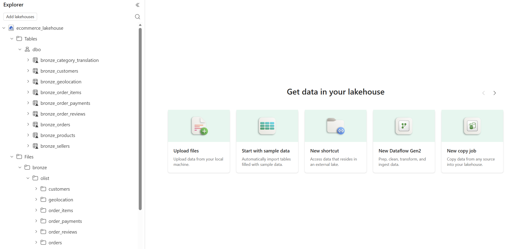

# Bronze Layer – Raw Data Ingestion

## Overview
The Bronze layer was implemented in a Microsoft Fabric Lakehouse to store raw data from the Olist Brazilian E-commerce dataset.

## Data Ingestion
- Raw CSV files were uploaded into the Lakehouse Files section.
- Data was organized using a source-based folder structure (`bronze/olist/...`).
- Each dataset was stored in its own directory.

## Table Creation
- Each CSV file was loaded into a corresponding table using Fabric’s Load to Table functionality.
- Tables were named using a consistent convention (`bronze_*`).

## Design Principles
- No transformations were applied.
- Data was preserved in its raw form.

## Screenshots

### Lakehouse Overview

### Folder Structure

### Bronze Tables
