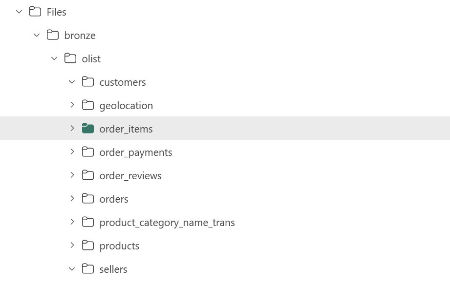
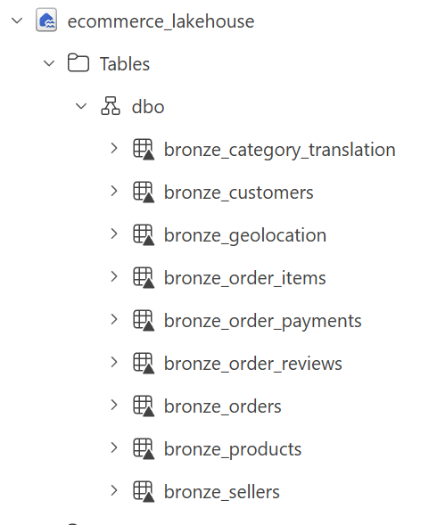

# Bronze Layer – Raw Data Ingestion

## Overview
The Bronze layer represents the raw data ingestion stage within the Microsoft Fabric Lakehouse.  
Its purpose is to store the original Olist Brazilian E-commerce dataset in its native format, serving as the foundation for downstream transformations.

This layer preserves data fidelity and enables traceability throughout the pipeline.

---

## Data Ingestion
- Raw CSV files were uploaded directly into the Lakehouse Files section.
- Data was organized using a source-based folder structure (`bronze/olist/...`) to maintain clarity and separation between datasets.
- Each dataset was stored in its own directory to reflect its original source.

---

## Table Creation
- Each CSV file was loaded into a corresponding table using Fabric’s **Load to Table** functionality.
- Tables were named using a consistent convention (`bronze_*`) to clearly identify their layer and purpose.
- No schema modifications or transformations were applied during this step.

---

## Design Principles
- **No transformations applied** – data is preserved exactly as received.
- **Source-aligned structure** – folder organization mirrors raw data sources.
- **Traceability** – ensures downstream layers can always reference original data.
- **Foundation for Medallion Architecture** – supports structured progression into Silver and Gold layers.

---

## Screenshots

### Lakehouse Overview

### Folder Structure

### Bronze Tables
