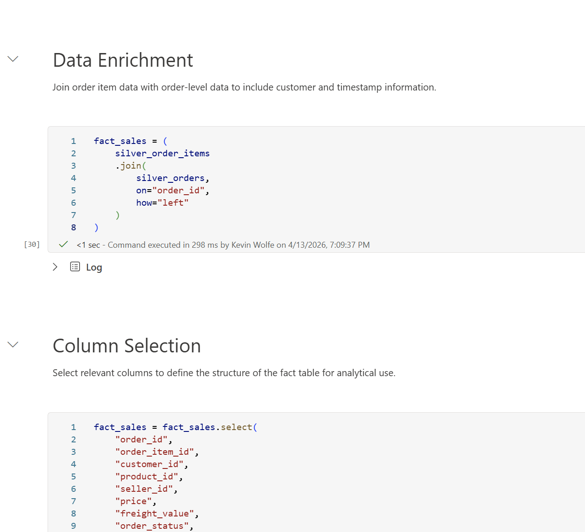

# Gold Layer – Analytical Model

## Overview

The Gold layer represents the final analytical model, structured as a star schema to support reporting and business insights.

Curated data from the Silver layer is combined and modeled into fact and dimension tables optimized for analytical performance and consumption in Power BI.

---

## Transformations Applied

- Joining order item and order-level data to construct a centralized fact table
- Selecting and refining columns for analytical reporting
- Creating dimension tables for customers, products, sellers, and date
- Ensuring proper grain (one row per order item) and uniqueness through deduplication
- Structuring data for efficient querying and filtering in Power BI

---

## Tables Created

### gold_fact_sales
- Fact table at the order item level (one row per order item)
- Contains transactional metrics such as price and freight value
- Includes timestamps for analysis across different stages of the order lifecycle

### gold_dim_customers
- Customer dimension table
- Contains geographic attributes (city, state)
- One row per customer

### gold_dim_products
- Product dimension table
- Includes category and descriptive attributes
- Built from enriched Silver layer data

### gold_dim_sellers
- Seller dimension table
- Contains seller location information
- One row per seller

### gold_dim_date
- Date dimension table
- Includes derived attributes such as year, month, day, quarter, and day of week
- Enables flexible time-based analysis

---

## Design Principles

- Implement a star schema for analytical efficiency and scalability
- Clearly separate fact and dimension tables
- Ensure consistent naming conventions (`gold_fact_*`, `gold_dim_*`)
- Leverage curated Silver layer data filtered to valid ("delivered") transactions
- Optimize data for reporting and visualization in Power BI

---

## Screenshots

### Notebook Overview

### Gold Tables

### Sample Fact Table

### Dimension Table Example
