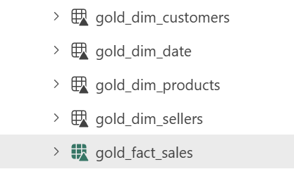
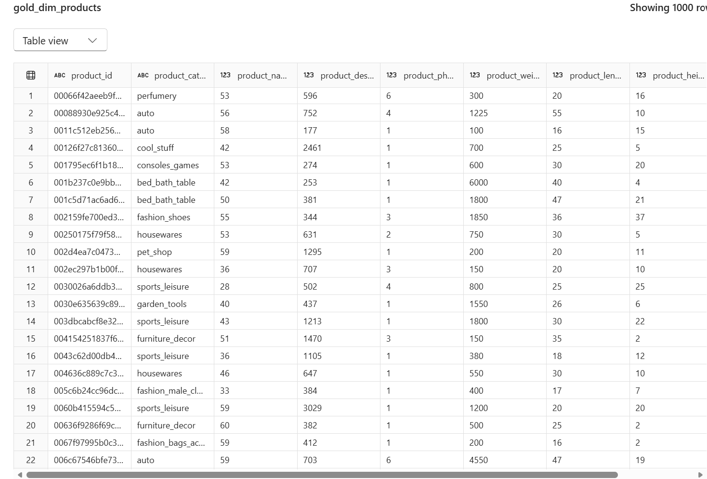

# Gold Layer – Analytical Model

## Overview

The Gold layer represents the final analytical model, structured as a star schema to support reporting and business insights.

Data from the Silver layer is combined and modeled into fact and dimension tables optimized for analytical use.

---

## Transformations Applied

- Joining order item and order-level data to create a fact table
- Selecting relevant columns for analytical reporting
- Creating dimension tables for customers, products, sellers, and date
- Ensuring proper grain and uniqueness through deduplication
- Structuring data for efficient querying in Power BI

---

## Tables Created

### gold_fact_sales
- Fact table at the order item level
- Contains transactional data including price, freight, and order status
- Includes timestamps for analysis across different stages of the order lifecycle

### gold_dim_customers
- Customer dimension table
- Contains location attributes (city, state)
- One row per customer

### gold_dim_products
- Product dimension table
- Includes category and descriptive attributes
- Enriched from Silver layer transformations

### gold_dim_sellers
- Seller dimension table
- Contains seller location information
- One row per seller

### gold_dim_date
- Date dimension table
- Includes derived attributes such as year, month, day, quarter, and day of week
- Supports time-based analysis

---

## Design Principles

- Implement a star schema for analytical efficiency
- Separate fact and dimension tables clearly
- Ensure consistent naming conventions (`gold_fact_*`, `gold_dim_*`)
- Optimize data for reporting and visualization in Power BI

---

## Screenshots

### Notebook Overview

### Gold Tables

### Sample Fact Table

### Dimension Table Example

