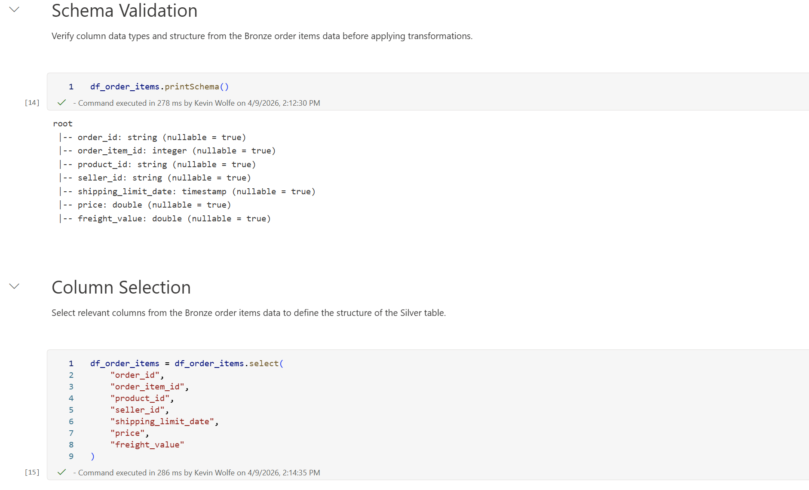

# Silver Layer – Data Transformation

## Overview

The Silver layer transforms raw Bronze data into clean, structured tables suitable for analytical modeling.

Data is standardized, filtered, and enriched to ensure consistency and usability for downstream analytics.

---

## Transformations Applied

- Column selection to remove unnecessary fields
- Data type validation
- Filtering (e.g., removing canceled orders)
- Data enrichment (joining product categories)
- Handling missing values (e.g., replacing null categories with "unknown")

---

## Tables Created

### silver_order_items
- Cleaned version of order items data
- Serves as the foundation for the fact table

### silver_orders
- Filtered to exclude canceled orders
- Contains order lifecycle timestamps

### silver_customers
- Simplified customer dimension
- Includes city and state information

### silver_products
- Enriched with English category names via join
- Missing categories handled

### silver_sellers
- Clean seller dimension
- Includes location data

---

## Design Principles

- Keep transformations minimal and intentional
- Maintain consistency across tables
- Prepare data for star schema modeling in Gold layer

---

## Screenshots

### Notebook Overview

### Silver Tables

### Sample Table
