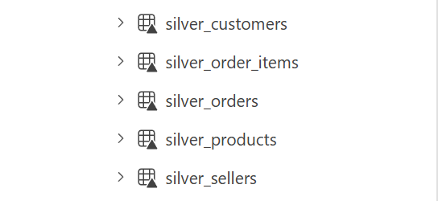
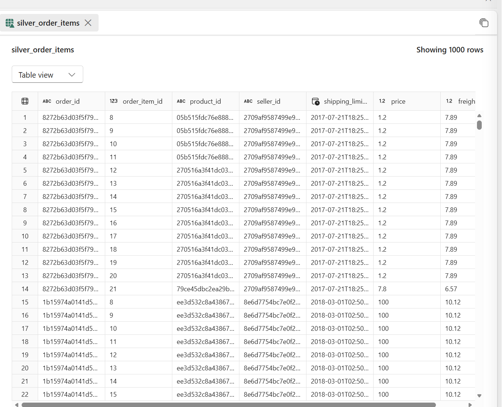

# Silver Layer – Data Transformation

## Overview

The Silver layer transforms raw Bronze data into clean, structured datasets optimized for analytical modeling.

At this stage, data is standardized, validated, and enriched to ensure consistency, accuracy, and usability for downstream analytics.

This layer introduces key business logic and prepares data for the star schema implemented in the Gold layer.

---

## Transformations Applied

- Column selection to remove unnecessary fields and reduce dataset size
- Data type validation to ensure consistency across tables
- Filtering to include only completed ("delivered") orders, ensuring accurate revenue and order metrics
- Data enrichment through joins (e.g., mapping product categories to English names)
- Handling missing values (e.g., replacing null categories with "unknown")

---

## Tables Created

### silver_order_items
- Cleaned version of order item-level data
- Serves as the primary input for the fact table in the Gold layer

### silver_orders
- Filtered to include only valid ("delivered") transactions
- Contains order lifecycle timestamps for time-based analysis

### silver_customers
- Simplified customer dimension
- Includes geographic attributes such as city and state

### silver_products
- Enriched with standardized English category names
- Missing or undefined categories handled

### silver_sellers
- Clean seller dimension
- Includes seller location information

---

## Design Principles

- Apply minimal but meaningful transformations
- Introduce business logic to ensure data reflects valid transactions
- Maintain consistency across datasets
- Prepare data for efficient star schema modeling in the Gold layer

---

## Screenshots

### Notebook Overview

### Silver Tables

### Sample Table
